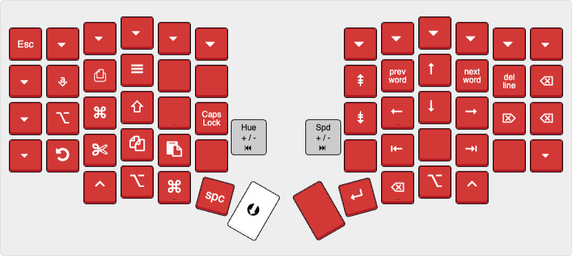

# Sofle Choc

[Default](http://www.keyboard-layout-editor.com/#/gists/8e4b4b7f8627d2eb591f63eed12a61de)

[Navigation](http://www.keyboard-layout-editor.com/#/gists/90262d589400804dd16d3872145b7dba)

[Symbol](http://www.keyboard-layout-editor.com/#/gists/74c600048b1fbcafd63b2badd97975b3)

[Adjust](http://www.keyboard-layout-editor.com/#/gists/7ac254567800b1ba3b6ad4edf00af15e)

My layout is very similar to the [default layout](http://www.keyboard-layout-editor.com/#/gists/5604075ad16c10a8c634828c5911d2b6) for the Sofle Choc except for the symbol layer which has been optimized for coding, taking inspiration from the [BEAKL 15 layout](https://deskthority.net/wiki/BEAKL#BEAKL_15) and [Sunaku's symbol layer]( https://sunaku.github.io/moergo-glove80-keyboard.html#symbol-layer).

### Useful resources
- [Designing a Symbol Layer](https://getreuer.info/posts/keyboards/symbol-layer/index.html)
- [Computer languages characters frequency](http://xahlee.info/comp/computer_language_char_distribution.html)
- [Balanced effortless advanced keyboard layout (BEAKL)](https://deskthority.net/wiki/BEAKL)